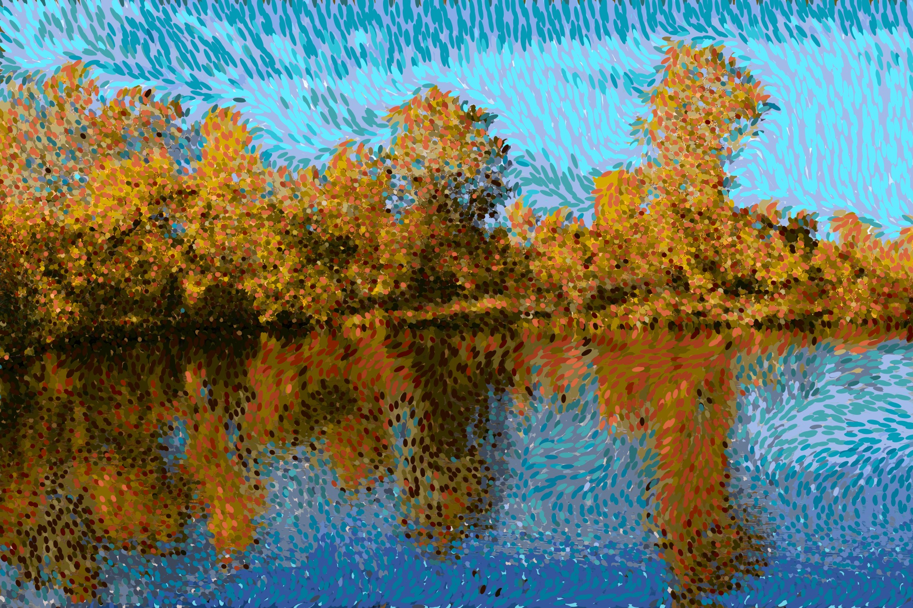
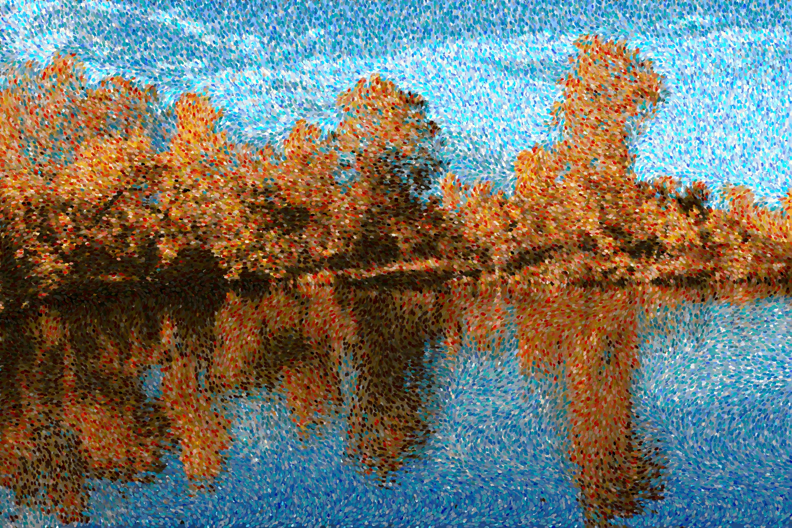
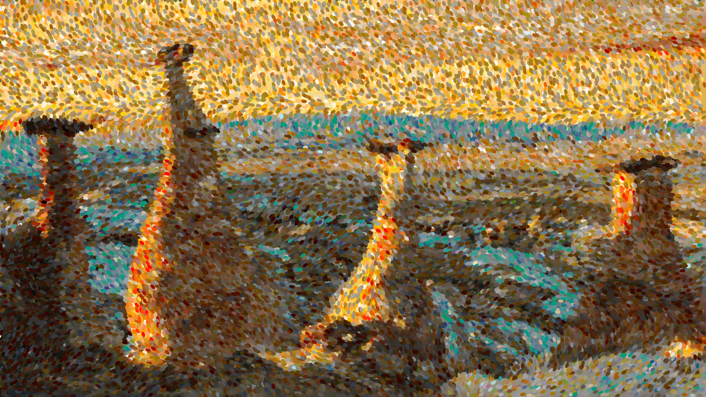

# Pointilizm

> ! Moved to https://codeberg.org/setanarut/Pointilizm

Convert a photo into a pointillist painting
  
A pure Golang port of [ronchetti/Pointillism](https://github.com/matteo-ronchetti/Pointillism) repo. There are slight differences in the algorithms.

## Samples

